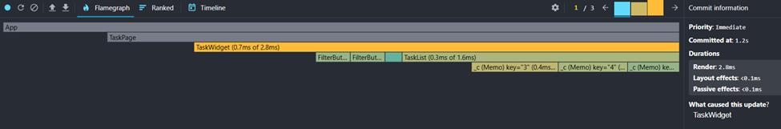
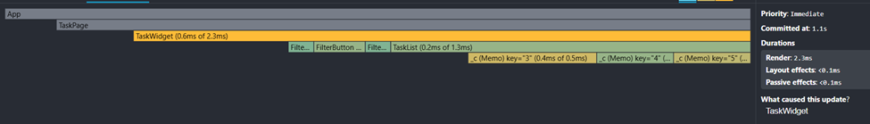

1. Внесла правки по первому домашнему заданию
2. Анализ производительности:
   Обернула TaskCard в React.memo, removeTask в useCallback. Перерисовываются кнопки фильтров (FilterButton), если переключаться между ними. Так же перерисовывается список тасок, соответственно из-за фильтров.
   
   
   В целом не заметно особых улучшений производительности, так как список маленький и в целом проект небольшой. Разница в милисекундах.
